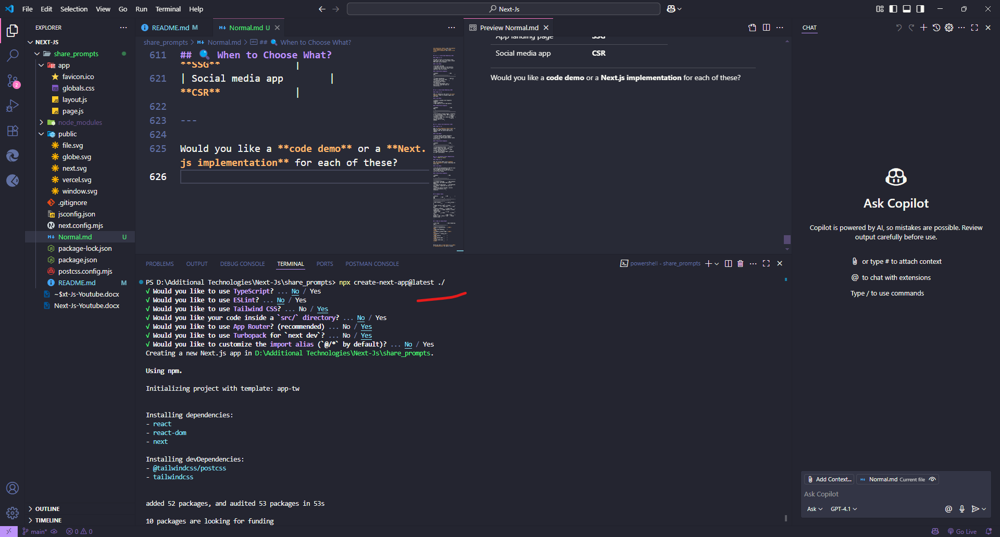

Q: what does Next-Js has which React-Js don't have ?
-
Great question! Let’s break down the **key differences between Next.js and React**, and **what Next.js provides that React does not**.

---

## 🧠 Quick Summary:

| 🔍 Feature                            | ✅ Available in Next.js | ❌ Not in React (alone) |
| ------------------------------------- | ---------------------- | ---------------------- |
| File-based routing                    | ✅ Yes                  | ❌ No                   |
| Server-side rendering (SSR)           | ✅ Yes                  | ❌ No                   |
| Static site generation (SSG)          | ✅ Yes                  | ❌ No                   |
| API routes (backend)                  | ✅ Yes                  | ❌ No                   |
| Image optimization                    | ✅ Yes (`next/image`)   | ❌ No                   |
| Built-in SEO features                 | ✅ Yes (`next/head`)    | ❌ No                   |
| Middleware / Edge Functions           | ✅ Yes                  | ❌ No                   |
| Incremental Static Regeneration (ISR) | ✅ Yes                  | ❌ No                   |
| Automatic code splitting              | ✅ Yes                  | ❌ Manual               |
| App directory with layouts            | ✅ Yes (Next.js 13+)    | ❌ No                   |
| Built-in deployment (Vercel ready)    | ✅ Yes                  | ❌ No                   |

---

## 🧱 React vs Next.js: Core Idea

* 🧩 **React** is a **library** for building UI components. It gives you the building blocks (components, hooks, context), but **not the structure**.
* 🚀 **Next.js** is a **framework built on top of React**. It gives you both the structure and extra features (routing, SSR, etc.) for **building full applications**.

---

## 🔍 What Exactly Next.js Adds That React Doesn’t:

### 1. ✅ **File-Based Routing**

* Just create a file in `/pages` and it becomes a route.
* In React, you need to manually set up routing using `react-router`.

```js
// Next.js
/pages/about.js → /about

// React
<BrowserRouter>
  <Route path="/about" element={<About />} />
</BrowserRouter>
```

---

### 2. ✅ **Server-Side Rendering (SSR) & Static Generation (SSG)**

Next.js allows you to **pre-render pages on the server**, great for SEO.

```js
export async function getServerSideProps(context) {
  return { props: { data } }
}
```

React doesn’t support SSR or SSG on its own. You need something like Next.js or Remix for that.

---

### 3. ✅ **API Routes (Backend Inside Frontend)**

In Next.js, you can write backend logic using files in `/pages/api`.

```js
// pages/api/hello.js
export default function handler(req, res) {
  res.status(200).json({ msg: "Hello" });
}
```

In React, you need to create a **separate Express server** or use third-party APIs.

---

### 4. ✅ **Image Optimization (`next/image`)**

Built-in component for automatically optimized images:

```js
<Image src="/logo.png" width={300} height={200} />
```

React requires you to use third-party libraries or CDN manually.

---

### 5. ✅ **Head Management (`next/head`)**

For SEO meta tags, titles, etc.

```js
import Head from 'next/head'
```

React requires `react-helmet` or similar.

---

### 6. ✅ **Built-in Performance Enhancements**

* Automatic code splitting
* Lazy loading
* Bundling and minifying out of the box

React apps require manual setup with Webpack/Vite or CRA ejecting.

---

### 7. ✅ **Layouts with App Directory (Next.js 13+)**

Next.js now supports persistent layouts and routing via `/app` folder using React Server Components — React alone doesn’t.

---

### 8. ✅ **Incremental Static Regeneration (ISR)**

Update static content **without rebuilding the entire site**.

```js
getStaticProps({ revalidate: 60 })
```

Not possible in React without custom backend.

---

### 9. ✅ **Middleware / Edge Functions**

Run code before a request is completed (e.g., auth check, redirects).

React has no built-in middleware capability.

---

## 📌 Summary

| Feature                   | React         | Next.js                |
| ------------------------- | ------------- | ---------------------- |
| UI Library                | ✅ Yes         | ✅ Yes (built on React) |
| Routing                   | ❌ No (manual) | ✅ Yes (file-based)     |
| SSR & SSG                 | ❌ No          | ✅ Yes                  |
| Backend (API)             | ❌ No          | ✅ Yes (API Routes)     |
| SEO Support               | ❌ No          | ✅ Yes (`next/head`)    |
| Performance Optimizations | ❌ Manual      | ✅ Built-in             |

---

## 🎯 So When to Use What?

* Use **React (only)** if:

  * You're building a small frontend app or SPA.
  * You want full control over routing, backend, etc.

* Use **Next.js** if:

  * You want full-stack capabilities.
  * You care about SEO, performance, scalability.
  * You want an all-in-one framework for production-ready apps.

---

Would you like a visual diagram of **React vs Next.js use-cases** or a **real-world example project to compare both**?

- yes:
Great! Let's now do a **deep comparison of React vs Next.js** in terms of:

---

### 🧠 Use Cases

### ⚙️ Performance

### 🧱 Scalability

### 📦 Ecosystem

### 🧪 Testing

### ☁️ Deployment

---

## ✅ 1. **Use Cases**

| Scenario                                  | Best Choice     | Why?                        |
| ----------------------------------------- | --------------- | --------------------------- |
| SPA with heavy dynamic interactions       | React + Vite    | Faster dev experience       |
| SEO-friendly website (blog, e-commerce)   | Next.js ✅       | SSR/SSG for better SEO      |
| Full-stack app with backend APIs          | Next.js ✅       | Has built-in API routes     |
| Static site with frequent content updates | Next.js ✅ (ISR) | Rebuild only required pages |
| Microfrontend or embedded widget          | React           | Lighter, more flexible      |

---

## ⚡ 2. **Performance**

| Feature            | React             | Next.js ✅           |
| ------------------ | ----------------- | ------------------- |
| Initial Load Speed | Slower (CSR only) | Faster (SSR or SSG) |
| SEO Crawling       | Harder            | Optimized           |
| Lazy loading       | Manual            | Auto + `next/image` |
| Code Splitting     | Manual via routes | Auto per page       |

**Conclusion:** Next.js wins when it comes to performance, especially for production websites.

---

## 🧱 3. **Scalability**

| Scaling Area             | React                | Next.js ✅                |
| ------------------------ | -------------------- | ------------------------ |
| Folder Structure         | Custom setup         | Opinionated structure    |
| Routing System           | Needs `react-router` | Built-in                 |
| Backend API              | Needs Express API    | Built-in API routes      |
| Middleware (Auth/Logs)   | Custom or 3rd party  | Built-in (Edge-ready)    |
| Server-Side Code Sharing | ❌                    | ✅ with server components |

**Conclusion:** For large-scale apps (e-commerce, dashboards, SaaS), **Next.js is more scalable** with fewer decisions to make.

---

## 🌍 4. **Ecosystem Integration**

| Feature                     | React       | Next.js ✅             |
| --------------------------- | ----------- | --------------------- |
| Backend APIs                | ❌           | ✅ API Routes          |
| Headless CMS (e.g., Sanity) | ✅           | ✅ Better SEO handling |
| Vercel Integration          | Needs setup | ✅ Native              |
| Image/CDN Optimization      | ❌           | ✅ `next/image`        |
| Serverless Deployment       | Manual      | ✅ Out of the box      |

---

## 🧪 5. **Testing Support**

| Tool/Framework              | React | Next.js |
| --------------------------- | ----- | ------- |
| Unit Testing (Jest)         | ✅     | ✅       |
| E2E Testing (Cypress)       | ✅     | ✅       |
| Integration with Playwright | ✅     | ✅       |

**No major differences**, but **Next.js** may need mocking of server functions during SSR.

---

## ☁️ 6. **Deployment**

| Platform         | React  | Next.js ✅          |
| ---------------- | ------ | ------------------ |
| Vercel           | Manual | One-click deploy ✅ |
| Netlify          | Good   | Good               |
| Render / Railway | Good   | Good               |
| Docker Support   | ✅      | ✅                  |
| SSR Hosting      | ❌      | ✅ Supported        |

---

## 🚀 Final Recommendation

| You want...                                                | Use             |
| ---------------------------------------------------------- | --------------- |
| Simple frontend with APIs on Express                       | React + Express |
| Fully integrated full-stack app (frontend + backend + SSR) | **Next.js ✅**   |
| Ultra SEO-optimized blog or landing site                   | **Next.js ✅**   |
| Highly interactive single-page app (SPA)                   | React           |

---

## 🔧 Tech Stack Suggestion for Full-Stack Ecommerce with Next.js

| Layer            | Technology                                         |
| ---------------- | -------------------------------------------------- |
| Frontend         | **Next.js (React)**                                |
| Backend          | **Next.js API Routes** or Express.js               |
| Database         | **MongoDB** or **PostgreSQL**                      |
| Auth             | **NextAuth.js** or Firebase Auth                   |
| Payment          | **Stripe** or Razorpay                             |
| State Management | **Zustand**, **Redux Toolkit**, or **Context API** |
| CMS (optional)   | **Sanity**, **Strapi**, or **Contentful**          |
| Deployment       | **Vercel** (best for Next.js)                      |

---

Want me to prepare a **roadmap** for building a full-stack e-commerce app with Next.js and MongoDB/PostgreSQL + Stripe + Admin Panel?
 - yes:

 Perfect — let’s now go deeper and **compare React vs. Next.js in terms of performance, scalability, and real-world use cases**, especially when building **full-stack or large-scale applications** like **e-commerce platforms**.

---

## 🏎️ Performance Comparison

| Criteria                | **React (CRA or Vite)**             | **Next.js**                   |
| ----------------------- | ----------------------------------- | ----------------------------- |
| **Rendering**           | CSR only (HTML built in browser)    | SSR, SSG, CSR, ISR ✅          |
| **Initial Load Time**   | Slower (client loads JS, then HTML) | Faster (can pre-render HTML)  |
| **SEO Optimization**    | Poor without extra setup            | Excellent out of the box ✅    |
| **Image Optimization**  | Manual / External libs              | Automatic with `next/image` ✅ |
| **Routing Performance** | Needs `react-router-dom`            | Built-in optimized router ✅   |
| **Code Splitting**      | Manual or via bundlers              | Automatic per page ✅          |

✅ **Next.js is more performant out of the box**, especially for public-facing, SEO-critical applications.

---

## 🧱 Scalability

| Feature                            | **React**                | **Next.js**                              |
| ---------------------------------- | ------------------------ | ---------------------------------------- |
| **Project Structure**              | Flexible (manual setup)  | Convention-based (more organized) ✅      |
| **Monorepo & Microfrontend Ready** | Possible (needs config)  | Easier with Turborepo, Vercel, etc ✅     |
| **Backend Integration**            | Needs Express or similar | Built-in API routes or custom servers ✅  |
| **Authentication & Middleware**    | Add manually             | Middleware support in Next.js 13+ ✅      |
| **Deployment**                     | Manual (Netlify, Vercel) | Seamless with Vercel, serverless ready ✅ |

✅ **Next.js scales better** for full-stack apps or teams with multiple developers due to its opinionated structure and server support.

---

## 🔥 Real-World Use Cases

| Use Case                    | Best Option                  | Why?                                                             |
| --------------------------- | ---------------------------- | ---------------------------------------------------------------- |
| **SEO-friendly Blog**       | ✅ Next.js                    | SSR/SSG helps with indexing and fast load                        |
| **E-Commerce App**          | ✅ Next.js                    | Static generation + dynamic server rendering = performance boost |
| **Dashboard (Admin Panel)** | React or Next.js (both fine) | Client-side heavy, not SEO critical                              |
| **Portfolio or Resume**     | ✅ Next.js                    | Quick to deploy, optimized by default                            |
| **PWA / SPA**               | React with Vite              | Faster development, simple CSR                                   |
| **Full-stack App**          | ✅ Next.js                    | Single repo for frontend + backend API                           |

---

## 🧰 What Next.js Can Replace

| Traditional Setup            | In Next.js (Replacement) |
| ---------------------------- | ------------------------ |
| React                        | Included                 |
| React Router                 | File-based routing ✅     |
| Express for simple APIs      | `pages/api/` ✅           |
| Webpack config               | Built-in ✅               |
| Image optimization libraries | `next/image` ✅           |
| SSR tools like Gatsby/Nuxt   | Native support in Next ✅ |

---

## 🚀 When You Should Use Next.js

Use **Next.js** if:

* You want great **SEO** and performance
* You’re building a **multi-page** site or e-commerce app
* You need both **frontend + backend** in one place
* You want to deploy fast with **Vercel** or **serverless** architecture

---

## 🤔 When Plain React is Enough

Use **React (CRA, Vite)** if:

* You’re building a **pure frontend dashboard**
* You don’t need SEO (like internal tools)
* You want **customized control** over everything

---

Would you like a full **Next.js project roadmap** (like folder structure, tools, libraries, backend tech stack) for an e-commerce site?

---------------------------------------
Q: what is client side rendering and servr side rendring all notes
- 
Here’s a complete breakdown of **Client-Side Rendering (CSR)** and **Server-Side Rendering (SSR)** — including definitions, differences, use cases, pros & cons.

---

## 🧠 1. What is Rendering?

**Rendering** is the process of converting code into HTML content to show on a webpage.

There are 2 main rendering approaches in modern web development:

---

## 🚀 2. Client-Side Rendering (CSR)

### ✅ What is it?

In **CSR**, the browser downloads a minimal HTML file and then uses JavaScript to render the entire UI **in the client** (browser).

### 🛠️ How it works:

1. Server sends an almost empty HTML file.
2. JavaScript bundle is loaded.
3. React (or any library) builds the UI in the browser.
4. Data fetching happens in the browser.

### 📦 Example (React App):

```html
<!-- index.html -->
<div id="root"></div>
<script src="bundle.js"></script>
```

### 👍 Pros:

* Better interactivity (after initial load)
* Good for Single Page Apps (SPAs)
* No page reloads after navigation

### 👎 Cons:

* Slower initial load
* Not SEO-friendly by default
* JS must be enabled on the client

### 📌 Use cases:

* Dashboards
* Internal tools
* Apps where SEO is not important

---

## 🖥️ 3. Server-Side Rendering (SSR)

### ✅ What is it?

In **SSR**, the HTML for each page is generated **on the server** for every request and sent to the browser — ready to display.

### 🛠️ How it works:

1. User requests a page.
2. Server fetches data + renders the HTML.
3. Browser receives full HTML (already built).
4. Then JavaScript is hydrated (adds interactivity).

### 📦 Example (Next.js):

```js
export async function getServerSideProps(context) {
  const res = await fetch('https://api.example.com/data');
  const data = await res.json();
  return { props: { data } };
}
```

### 👍 Pros:

* SEO-friendly ✅
* Faster first content paint (good for UX)
* Content is visible without JS

### 👎 Cons:

* Slower page navigation (compared to CSR)
* More load on server
* Every request requires server computation

### 📌 Use cases:

* Blogs, e-commerce sites
* News websites
* SEO-critical apps

---

## 🔄 Comparison Table

| Feature            | Client-Side Rendering (CSR) | Server-Side Rendering (SSR)     |
| ------------------ | --------------------------- | ------------------------------- |
| Initial load speed | Slow                        | Fast                            |
| SEO                | Poor (needs extra setup)    | Good (HTML is already there)    |
| Interactivity      | Great                       | Great (after hydration)         |
| Server Load        | Low                         | High (renders on every request) |
| Code Complexity    | Lower                       | Slightly Higher                 |
| JS Required?       | Yes                         | Not immediately                 |
| Example Frameworks | React, Vue, Angular         | Next.js, Nuxt.js                |

---

## 🧑‍💻 Bonus: Hybrid Rendering (Next.js)

Next.js allows you to **mix SSR, CSR, and SSG (Static Site Generation)** in one app.

Example:

* Home page → SSR
* Dashboard → CSR
* Blog → SSG

---

Let me know if you want explanations of:

* **Static Site Generation (SSG)**
* **Incremental Static Regeneration (ISR)**
* Real-world examples and when to use each

Real-world examples and when to use each
- 
Here’s a detailed explanation of **Client-Side Rendering (CSR)**, **Server-Side Rendering (SSR)**, **Static Site Generation (SSG)**, and **Incremental Static Regeneration (ISR)** — with **real-world examples** and **when to use each**:

---

## 🧑‍💻 1. Client-Side Rendering (CSR)

### ✅ What it is:

The HTML is built in the browser using JavaScript. The server only sends a blank HTML shell and JS bundles.

### 🔧 Use When:

* You don’t need SEO.
* The data is private or user-specific.
* Speed after the initial load is more important than first paint.

### 🌍 Real-World Examples:

| Example                     | Why CSR?                                     |
| --------------------------- | -------------------------------------------- |
| 🔐 Admin Dashboards         | SEO not required; secure user data.          |
| 📊 Analytics Panels         | Interactive data charts, user-specific.      |
| 📁 Project Management Tools | User-driven views and heavy JS interactions. |

---

## 🖥️ 2. Server-Side Rendering (SSR)

### ✅ What it is:

HTML is rendered on the server **on every request**, ideal for dynamic pages with SEO needs.

### 🔧 Use When:

* Content is dynamic and frequently changing.
* SEO is important.
* Page speed for first load matters.

### 🌍 Real-World Examples:

| Example                      | Why SSR?                                          |
| ---------------------------- | ------------------------------------------------- |
| 🛍️ E-commerce Product Pages | Inventory or pricing changes often; SEO is vital. |
| 📰 News Articles             | Updated frequently; needs fast rendering + SEO.   |
| 🧾 Job Listings              | Search engines need to crawl content.             |

---

## 📦 3. Static Site Generation (SSG)

### ✅ What it is:

HTML is **pre-rendered at build time**, so pages are ready instantly when a user requests them. No server-side work on request.

### 🔧 Use When:

* Content doesn’t change frequently.
* You want ultra-fast load speeds.
* Perfect for SEO-friendly content that’s mostly static.

### 🌍 Real-World Examples:

| Example                    | Why SSG?                               |
| -------------------------- | -------------------------------------- |
| 📘 Documentation Sites     | Rarely changes, needs fast load + SEO. |
| 🧑‍💼 Personal Portfolios  | Fixed content, SEO important.          |
| 🛒 Marketing Landing Pages | Designed for SEO + performance.        |

---

## 🔁 4. Incremental Static Regeneration (ISR) – *(Next.js only)*

### ✅ What it is:

SSG, but allows pages to be **updated after deployment**, without rebuilding the whole site.

### 🔧 Use When:

* You want the performance of SSG but also want to update content regularly.
* You don’t want to rebuild the entire site on every change.

### 🌍 Real-World Examples:

| Example                   | Why ISR?                                                 |
| ------------------------- | -------------------------------------------------------- |
| 📦 Product Catalogs       | New products added daily, but don’t need instant update. |
| 📰 Blog with New Posts    | Pre-generate old content, regenerate new ones as needed. |
| 📚 Online Course Listings | Courses update occasionally, not instantly.              |

---

## ⚖️ Summary Table

| Feature              | CSR             | SSR           | SSG             | ISR                  |
| -------------------- | --------------- | ------------- | --------------- | -------------------- |
| SEO Friendly         | ❌ (extra setup) | ✅             | ✅               | ✅                    |
| Speed (Initial Load) | ⏳ Slower        | ⚡ Fast        | 🚀 Very Fast    | 🚀 Very Fast         |
| Content Freshness    | ✅ Real-time     | ✅ Real-time   | ❌ Needs rebuild | ✅ After regeneration |
| Server Load          | ✅ Low           | ❌ High        | ✅ None          | ✅ Very Low           |
| Best For             | SPAs, Tools     | Dynamic + SEO | Static + SEO    | Mixed Content Sites  |

---

## 🔍 When to Choose What?

| Site Type               | Best Rendering Type |
| ----------------------- | ------------------- |
| Blog or documentation   | **SSG / ISR**       |
| Real-time dashboard     | **CSR**             |
| E-commerce product page | **SSR / ISR**       |
| Portfolio / resume site | **SSG**             |
| News website            | **SSR**             |
| App landing page        | **SSG**             |
| Social media app        | **CSR**             |

---

Would you like a **code demo** or a **Next.js implementation** for each of these?

Project Structure details: 
- 


Great! You’ve created a Next.js project using the `app-tw` template, which includes Tailwind CSS. Let me now explain the **purpose of all default folders and files** shown in your Visual Studio Code workspace, based on the image you provided.

---

## 📁 Folder & File Structure in Your Next.js Project

### 1. **`app/`**

> ✅ **Core folder in the new App Router (Next.js 13+)**

* This is where you define routes and layout structure using React Server Components.
* Each folder inside `app/` can represent a route. Example: `app/about/page.jsx` → `/about`
* **`layout.js`**: Shared layout (like navbars or footers) applied to all child routes.
* **`page.js`**: Represents a single route/page (like `index.js` in older versions).
* It supports nested layouts and route segments.

---

### 2. **`public/`**

> ✅ **For static assets** (accessible directly via URL)

* You can place images, icons, fonts, or any file you want publicly available.
* Example: `public/logo.png` is available at `http://localhost:3000/logo.png`.

**In your image, it includes:**

* `next.svg`, `vercel.svg`, `globe.svg`, etc. — default assets/icons for demo use.

---

### 3. **`.gitignore`**

> 📄 Specifies which files/folders Git should ignore

* Prevents committing unnecessary files like `node_modules`, `.next`, etc.

---

### 4. **`jsconfig.json`**

> 📄 JS/TS project configuration for better path resolution

* Helps VSCode and Next.js understand custom import aliases.
* Often used to simplify imports like:

  ```js
  import Button from "@/components/Button";
  ```

---

### 5. **`next.config.mjs`**

> 🛠️ Configuration file for Next.js behavior

* Modify build settings, enable features like images, i18n, rewrites, etc.
* Uses `.mjs` because it’s in ESM format.

---

### 6. **`package.json`**

> 📦 Project manifest

* Contains metadata, scripts, and dependency list.
* Defines commands like `npm run dev`, `npm run build`, etc.

---

### 7. **`postcss.config.js`**

> 🧵 Used by Tailwind CSS (PostCSS processor)

* Handles Tailwind’s CSS transformations.
* Required to process Tailwind directives like `@apply`, `@tailwind`.

---

### 8. **`tailwind.config.js`**

> 🎨 Tailwind CSS configuration

* Customize Tailwind’s theme, colors, breakpoints, etc.
* You can extend or override default utility classes here.

---

### 9. **`README.md`**

> 📝 Project overview or instructions

* Markdown file to document your project.
* Great for GitHub repos or collaboration.

---

### 10. **`.vscode/` (not shown but common)**

> ⚙️ Optional, editor-specific settings

* VS Code stores project-level settings here (themes, formatting, extensions).

---

### 11. **`node_modules/`**

> 📁 Auto-generated by npm

* Contains all the installed packages/dependencies.
* **You never edit this manually**.

---

### 12. **`package-lock.json`**

> 📄 Auto-generated by npm

* Locks the exact versions of packages installed.
* Ensures consistency across environments.

---

## ✅ Summary (Table)

| Folder/File          | Purpose                                      |
| -------------------- | -------------------------------------------- |
| `app/`               | Routes, layouts, pages (new routing system)  |
| `public/`            | Static assets like images, logos             |
| `next.config.mjs`    | Next.js configuration (plugins, settings)    |
| `postcss.config.js`  | PostCSS processing for Tailwind              |
| `tailwind.config.js` | Customize Tailwind styles                    |
| `.gitignore`         | Files to ignore in Git                       |
| `jsconfig.json`      | Configure aliases and imports                |
| `README.md`          | Documentation of the project                 |
| `package.json`       | Lists dependencies and scripts               |
| `package-lock.json`  | Locks exact dependency versions              |
| `node_modules/`      | Actual package source files (auto-generated) |

---

Let me know if you want:

* How to add components folder
* How to set up API routes
* Page routing example with nested folders
* Tailwind usage examples

Ready when you are 🚀
