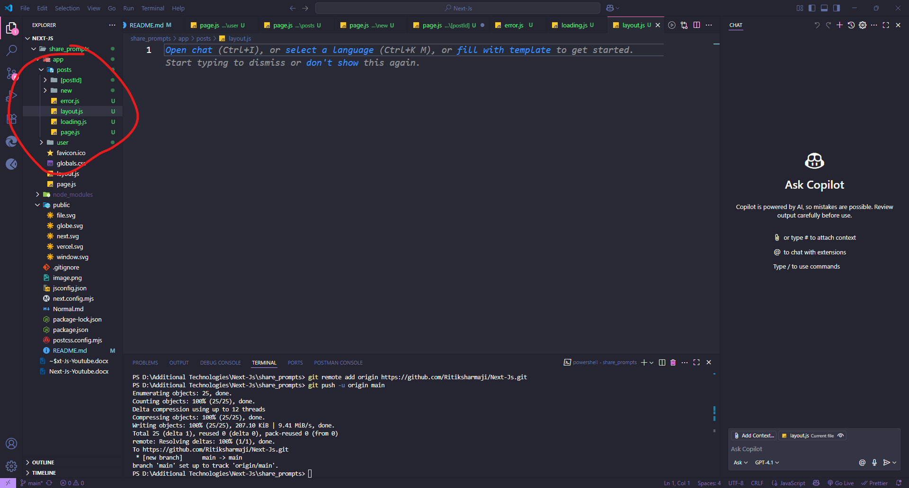
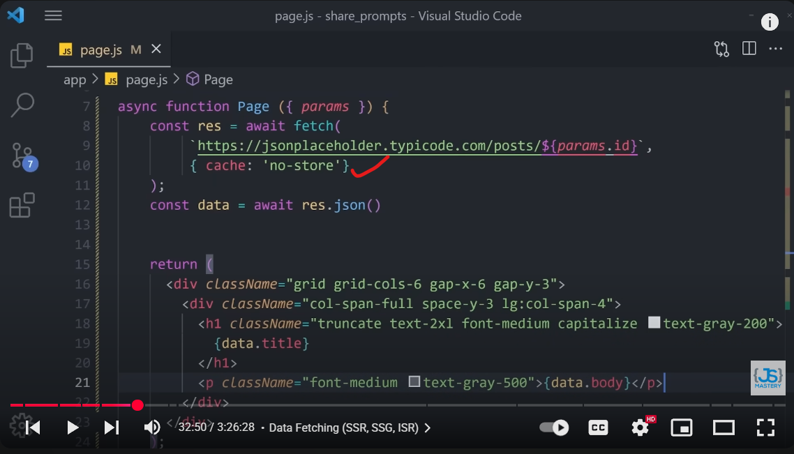
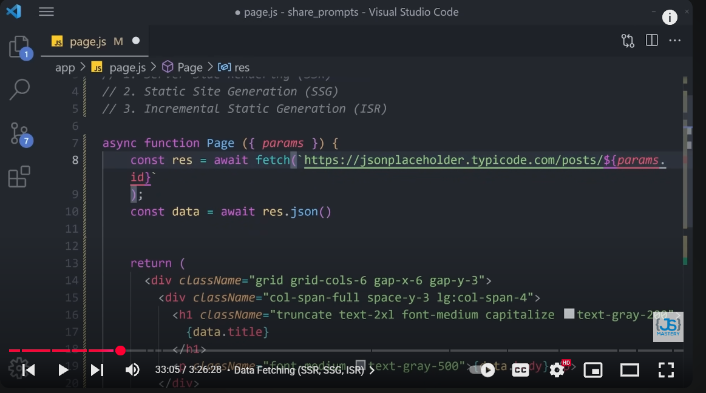
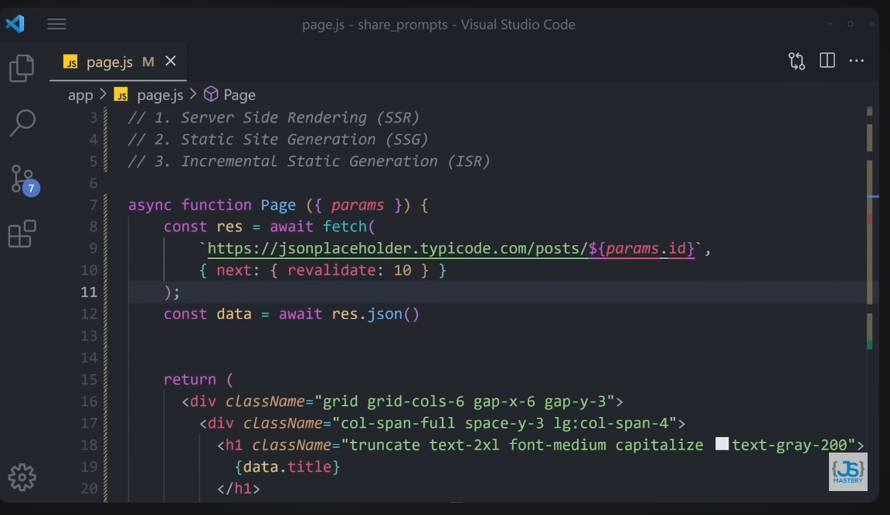
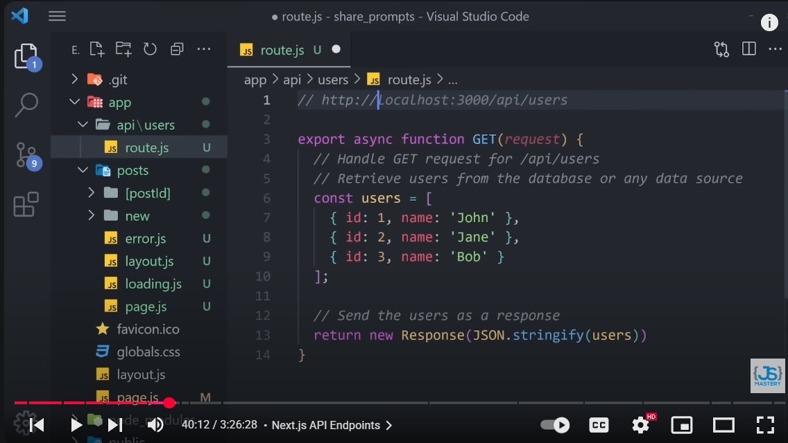

# ------------
 - to install a next js application: npx create-next-app@latest app_name
 
 ----------
 1) react js render UI at client side while next js perform rending at servr side also provide option to choice the UI either client side or server side based on our requirement
 2) in server side rending the web page on the seerver before transmitting it to the client's device so, when user request a page to server then server process request and render the component on the server side then sever send back the fully rended html t client browser at that time to display. and this dictinction highlights an essential aspect of web dev that is SEO.
 3) while sending dynamic data SEO face issues while resoved By sending pre-rendering code  directly to the client which enables:
 - easy crawling 
 - indexing 
 - leading to improved SEO.

 feacture-2: 
Routing - it use file based routing 
- 


### -------------- Routing & Special Next.js Files ----------------

explain the use of page.js , loading.js,layout.js, error.js and [postId] folder  in a particul folder of next js application just take example of screenshort which i am sharing with you
- 

Great! You're working with the **App Router** in a **Next.js 13+ project**, and the screenshot shows a well-structured route setup inside the `app/posts/` folder.

Let me explain the **purpose of each file/folder**: `page.js`, `layout.js`, `loading.js`, `error.js`, and `[postId]` — using your screenshot as a reference.

---

## 📁 Folder Structure: `app/posts/`

```bash
app/
└── posts/
    ├── [postId]/       🔹 Dynamic route
    │   └── page.js     📄 Shows individual post based on postId
    ├── new/            📁 Subroute: /posts/new
    │   └── page.js
    ├── error.js        ❌ Custom error UI for any /posts/* route
    ├── layout.js       🧩 Shared layout for all children in /posts/
    ├── loading.js      ⏳ UI for loading state during data fetch
    └── page.js         📄 Main posts page: /posts
```

---

## 🔍 File Breakdown

| File/Folder        | Purpose                                                                                    | URL Example                    |
| ------------------ | ------------------------------------------------------------------------------------------ | ------------------------------ |
| `page.js`          | Entry point for `/posts` route (Post listing)                                              | `/posts`                       |
| `layout.js`        | Defines shared layout (e.g., sidebar, header) for all children like `/posts`, `/posts/new` | Wraps all `/posts/*` routes    |
| `loading.js`       | Displays while data for `/posts` or its children is loading                                | Shown during fetch transitions |
| `error.js`         | Renders when any error is thrown in `/posts` or nested components                          | E.g., API failure, 404 error   |
| `[postId]/page.js` | Dynamic route for individual blog post (e.g., `/posts/123`)                                | `/posts/abc`, `/posts/101`     |
| `new/page.js`      | Separate route for creating a new post                                                     | `/posts/new`                   |

---

## 📌 Example Use Case

Imagine you're building a blog:

### 🗂 `app/posts/page.js`

```js
export default function PostsPage() {
  return <h1>All Blog Posts</h1>;
}
```

📍 Route: `/posts`

---

### 🗂 `app/posts/[postId]/page.js`

```js
export default function SinglePost({ params }) {
  return <h1>Post ID: {params.postId}</h1>;
}
```

📍 Route: `/posts/123`, `/posts/react-hooks`

---

### 🗂 `app/posts/layout.js`

```js
export default function PostsLayout({ children }) {
  return (
    <div>
      <aside>Sidebar or Navigation</aside>
      <main>{children}</main>
    </div>
  );
}
```

📍 Wraps all `/posts` pages — reuse layout for each child route.

---

### 🗂 `app/posts/loading.js`

```js
export default function Loading() {
  return <p>Loading posts...</p>;
}
```

📍 Auto-shown while server components (or fetch) are loading.

---

### 🗂 `app/posts/error.js`

```js
'use client';

export default function Error({ error, reset }) {
  return (
    <div>
      <h2>Something went wrong!</h2>
      <button onClick={() => reset()}>Try again</button>
    </div>
  );
}
```

📍 Catch and handle errors for this route and nested children.

---

## ✅ Summary Table

| File Name    | Purpose                             | Server/Client | Shown When                        |
| ------------ | ----------------------------------- | ------------- | --------------------------------- |
| `page.js`    | Main content of the route           | Server        | When route is loaded normally     |
| `layout.js`  | Shared layout across children       | Server        | Wraps page + nested routes        |
| `loading.js` | Loading UI for slow data fetching   | Server        | During async loading/fetching     |
| `error.js`   | Custom error UI                     | Client        | When an error occurs in rendering |
| `[postId]/`  | Dynamic segment to show single post | Server        | When `/posts/[slug]` is visited   |

---

Let me know if you want:

* A diagram of nested routes
* Example of fetching data in `page.js`
* Server vs client components in this folder

Would you like to turn this into an actual blog project?

------
Data fetching 
- 
In **Next.js**, there are multiple **types of data fetching** depending on whether you want data at **build time**, **on each request**, or **on the client side**. Here's a complete overview:

---

### 🔵 **1. Static Generation (SSG)**

> Data is fetched **at build time** and reused for all requests.

| Feature  | Description                                                |
| -------- | ---------------------------------------------------------- |
| API used | `getStaticProps()`                                         |
| Use case | Blog posts, landing pages, documentation                   |
| Pros     | Very fast (served from CDN), SEO-friendly                  |
| Cons     | Not suitable for frequently changing data unless using ISR |

---

### 🔵 **2. Server-side Rendering (SSR)**

> Data is fetched **on each request**.

| Feature  | Description                                         |
| -------- | --------------------------------------------------- |
| API used | `getServerSideProps()`                              |
| Use case | Dashboard, user-specific pages, authenticated pages |
| Pros     | Always up-to-date, SEO-friendly                     |
| Cons     | Slower due to server work per request               |

---

### 🔵 **3. Client-side Fetching (CSR)**

> Data is fetched **after the page is loaded** using `useEffect`.

| Feature  | Description                                             |
| -------- | ------------------------------------------------------- |
| API used | Fetch/Axios inside `useEffect`                          |
| Use case | User interactions, dynamic data (e.g., filters, search) |
| Pros     | Quick page loads, less server load                      |
| Cons     | Not SEO-friendly initially, may flash empty content     |

---

### 🔵 **4. Incremental Static Regeneration (ISR)**

> **Updates static pages** without rebuilding the entire site.

| Feature  | Description                               |
| -------- | ----------------------------------------- |
| API used | `getStaticProps()` with `revalidate`      |
| Use case | Blog with periodic content updates        |
| Pros     | Combines benefits of SSG and dynamic data |
| Cons     | Slight delay in update reflection         |

---

### 🔵 **5. Route Handlers / API Routes (Edge Functions & Middleware)**

> For creating **custom backend logic** like form handlers, auth, etc.

| Feature  | Description                                                                 |
| -------- | --------------------------------------------------------------------------- |
| API used | `/api/` directory (e.g., `/api/login`)                                      |
| Use case | Form submissions, auth, backend logic                                       |
| Runs     | On server / edge at request time                                            |
| Pros     | Keep backend logic in same project                                          |
| Cons     | Not suitable for heavy backend logic (better to use external API/DB server) |

---

### ✅ **Summary Table**

| Type                   | Method                               | SEO Friendly | When to Use                             |
| ---------------------- | ------------------------------------ | ------------ | --------------------------------------- |
| Static Generation      | `getStaticProps()`                   | ✅ Yes        | Marketing pages, blogs                  |
| Server-side Render     | `getServerSideProps()`               | ✅ Yes        | Auth pages, dynamic user dashboards     |
| Client-side Fetch      | `useEffect + fetch`                  | ❌ No         | Filters, UI-only changes, optional data |
| ISR (SSG + Revalidate) | `getStaticProps()` with `revalidate` | ✅ Yes        | News sites, semi-static content         |
| API Routes             | `/pages/api/*.ts/js`                 | N/A          | Backend logic in frontend project       |

---

If you’d like, I can also provide **code examples** for each.

example: for SSR 


- for SSG Example:

just remove the cache one it means next-js by-default support the SSG type 
- example for ISR type:

- 

### ----- Next.js API Endpoints details -----

### ✅ Next.js API Routes – Complete Guide

Next.js provides **built-in API routes**, allowing you to create serverless backend functions **inside the same project**. These can be used to handle form submissions, database queries, authentication, etc.

---

## 📌 1. **What are API Routes?**

API routes are special **backend functions** in the `pages/api/` directory. Each file becomes a separate endpoint.

> 📁 `pages/api/hello.js` → Accessible at `https://your-domain.com/api/hello`

---

## 🛠 2. **Creating an API Route**

Create a JS/TS file inside `pages/api/`.

```js
// pages/api/hello.js
export default function handler(req, res) {
  res.status(200).json({ message: "Hello from API!" });
}
```

### 🔁 Supported HTTP Methods:

```js
export default function handler(req, res) {
  const { method } = req;

  switch (method) {
    case 'GET':
      res.status(200).json({ msg: "GET request" });
      break;
    case 'POST':
      res.status(201).json({ msg: "POST request" });
      break;
    default:
      res.setHeader('Allow', ['GET', 'POST']);
      res.status(405).end(`Method ${method} Not Allowed`);
  }
}
```

---

## 🔐 3. **Use Cases for API Routes**

| Use Case                 | Example                                  |
| ------------------------ | ---------------------------------------- |
| Form handling            | `/api/contact-form`                      |
| Authentication/Login     | `/api/auth/login`                        |
| Database CRUD            | `/api/products` (GET, POST, PUT, DELETE) |
| Sending Emails           | `/api/send-email`                        |
| Calling third-party APIs | `/api/weather?city=London`               |

---

## 📄 4. **Working with Query & Body**

```js
export default function handler(req, res) {
  const { query } = req; // For GET
  const { name } = req.body; // For POST
  res.status(200).json({ name, query });
}
```

---

## 💾 5. **Connecting to a Database (e.g., MongoDB)**

```js
import connectToDB from '@/lib/mongodb';

export default async function handler(req, res) {
  await connectToDB();
  const data = await SomeModel.find();
  res.status(200).json(data);
}
```

---

## ⚠️ 6. **API Route Limitations**

| Limitation                        | Explanation                                               |
| --------------------------------- | --------------------------------------------------------- |
| Not meant for large backend logic | Use a dedicated backend (e.g., Express, NestJS) if needed |
| Not available in static exports   | Only works in Serverless deployments (e.g., Vercel)       |
| No middlewares by default         | You must implement authentication/validation manually     |

---

## 🚀 7. **Deployment Notes**

Next.js API routes are deployed as **serverless functions** on platforms like:

* **Vercel (native support)**
* **Netlify**
* **AWS Lambda (via adapter)**

---

## 🧪 8. **Testing API Route**

You can access the route via:

```bash
curl http://localhost:3000/api/hello
```

Or via client-side code:

```js
const res = await fetch('/api/hello');
const data = await res.json();
```

---

## 🧱 Directory Structure Example:

```
pages/
  api/
    auth/
      login.js
      register.js
    products/
      index.js
      [id].js
```

---

Would you like me to help you build real examples like:

* Product CRUD using API routes?
* Authentication endpoint?
* DB integration?



##  
SEO & Metadata
 